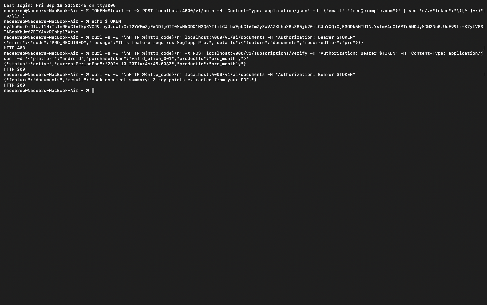

# MagTapp Founding Engineer Assignment

Nadeer E P · September 2026

| | |
|---|---|
| [Product observations](docs/00-product-observations.md) | Bugs I hit using the live app |
| [Architecture](docs/01-architecture.md) | Flutter → API → backend → DB → AWS |
| [MagTapp Pro](docs/02-pro-subscription.md) | Subscription design and entitlement |
| [AWS cost & reliability](docs/03-aws-cost-and-reliability.md) | First two weeks |
| [Prototype](prototype/backend) | Working backend — Option B |

## Approach

I used the app for a few hours before writing anything. That shaped most of the
decisions — which parts cost money, which need no backend, and where there's
already an access-tier concept to build on. It also turned up the bugs in the
observations doc.

Three decisions I'd most want to explain:

**Entitlement is computed, never stored.** No `isPro` field anywhere. It's
derived from subscription status and period end each time, so it expires on its
own and there's no field for a request body to overwrite.

**Which features are Pro is data, not code.** It's a database row, so changing
what's free means an update rather than a release. This is MagTapp's first paid
tier and the free/paid line will need tuning after launch.

**Modular monolith, not microservices.** One engineer can't operate a
distributed system. Same boundaries, one deployable.

## Prototype

Option B. Node, Express, MongoDB. I chose backend over the Flutter screen
because the security argument in the subscription doc only means something if
it's shown working.



Identical requests, same token. Only a server-written row changed.

```bash
cd prototype/backend
npm install && cp .env.example .env && npm run seed && npm start
```

Then open `requests.http` in VS Code, or use the curl commands in
[prototype/backend/README.md](prototype/backend/README.md).

Also covered: free-tier rate limiting (429), invalid receipts (422), the same
receipt claimed by a second account (409), webhook idempotency, and expiry.

Store verification is mocked — a token starting `valid_` stands in for the Play
Developer API or App Store Server API call.

## Left out

Redis caching (in the architecture doc, but the prototype reads Mongo directly
so the logic stays visible), real IAP integration, and a Flutter screen.