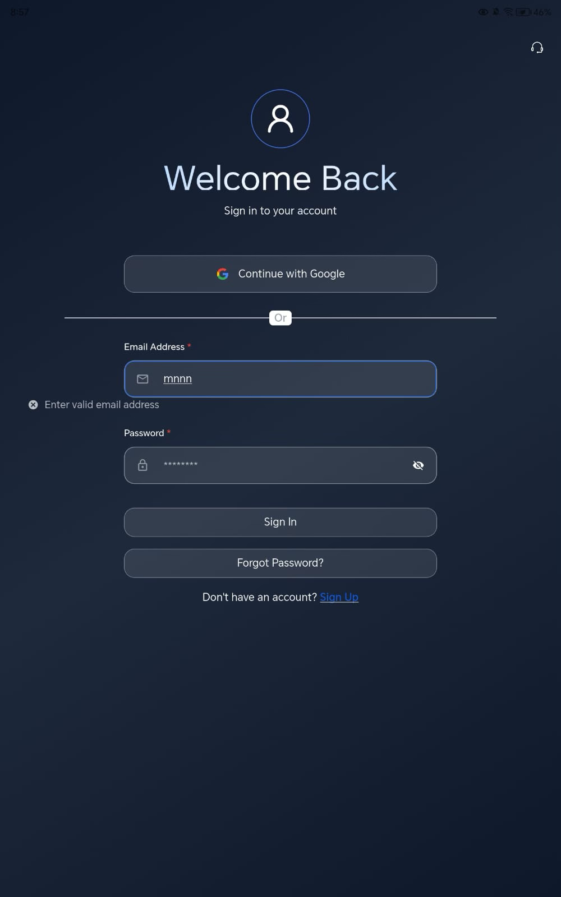
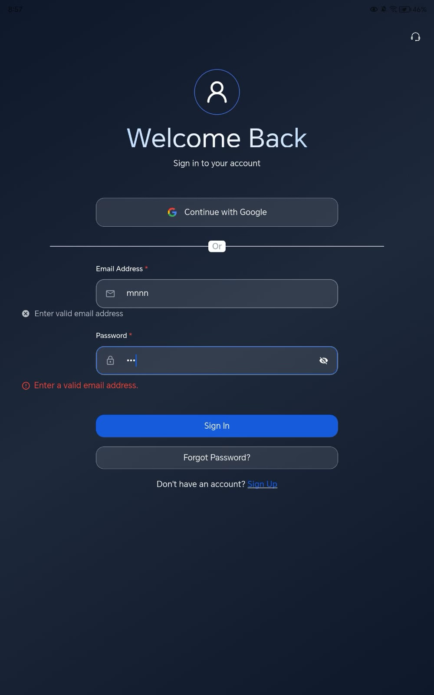
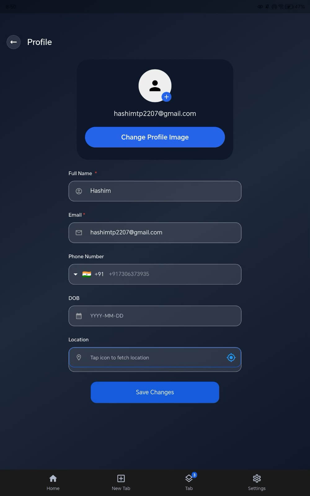
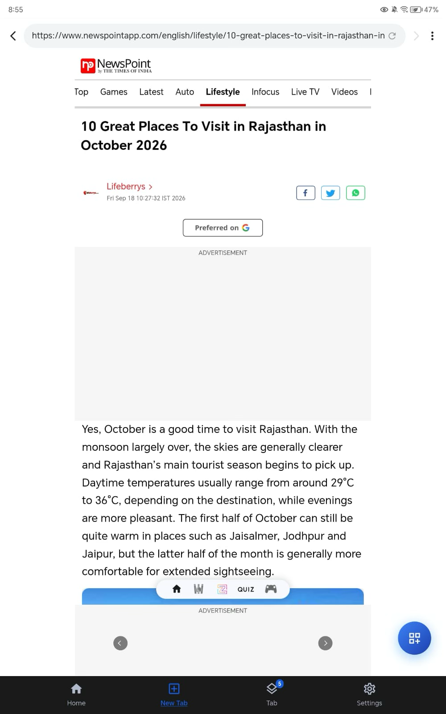

# Product Observations

I installed the live MagTapp build from the Play Store on an Android tablet and spent a few hours using it the way a normal user would. Signing in, editing my profile, reading web pages, translating one, trying read-aloud, and asking the AI some questions. Everything below came up during that, not from digging for bugs.

These are the things I ran into. Most are small. A couple are not.

## 1. Google Sign-In fails after you pick an account

The account chooser opens and resolves the app correctly. It says "to continue With Google", so the client ID and package name are registered on Google's side. It breaks
after I pick an account. Nothing completes.

My guess is the Play App Signing SHA-256 isn't registered in Firebase / Google Cloud.
Play re-signs the app with its own key, not the upload key, so the fingerprint in the
shipped build doesn't match the one registered. That pattern fits the symptom exactly:
debug builds work, the Play build doesn't, and nobody catches it until release.

With repo access I'd confirm it in this order:

- `adb logcat | grep ApiException`. Status 10 (DEVELOPER_ERROR) confirms a fingerprint
  mismatch.
- Compare Play Console → App integrity → app signing certificate against the fingerprints
  listed in Firebase.
- Check `google-services.json` was regenerated *after* the fingerprint was added. It often
  isn't, and the stale file ships.
- Check `serverClientId` is set, so an ID token gets issued for backend verification and
  not just an access token.

## 2. The sign-in failure is silent

When it fails you just land back on the sign-in screen. No error, no snackbar, no
inline message. Nothing changes on screen.

So the user can't tell whether sign-in failed, whether their account isn't registered, or
whether they should just try again. I couldn't tell either. Without logcat I can't
distinguish a real failure from a sign-in I cancelled myself, and the user has no logcat.

The error is being caught somewhere and never making it into UI state. Fix is to map
failure causes to messages: config errors get "Sign-in isn't available right now, try
email sign-in", network errors get a retry, user cancellation stays silent. Raw cause goes
to Crashlytics, not to the screen.

## 3. Validation messages are broken on the sign-in form

Type an invalid email and two things go wrong at once.

The format error renders below the *password* input, not the email input it
belongs to. And the same rule fires twice with two different strings and two
different styles. "Enter valid email address" in grey with an ✕ above the
password field, and "Enter a valid email address." in red with a ⚠ below it.
Two validators, two error widgets, one rule.

The grey one is also low contrast on the dark background and doesn't read as
an error at all. It reads like a hint.

Both come from the same thing. Validation state isn't owned per field, so the
message lands wherever the form last rebuilt, and the rule got implemented
twice because there was no single place for it. I'd fix it with one
`FormFieldState` per input, one `EmailValidator` used by both the field and
the submit guard, and one shared `FieldErrorText` widget. That's one
component, and it fixes every other form in the app at the same time.

## 4. Profile fields look editable but aren't

Phone number, email and location render as normal text inputs, but I can't edit any of
them. Location is the worst of the three. It draws a focus ring and says "Tap icon to
fetch location", so it actively invites a tap it then doesn't honour.

The problem is that I can't tell which thing is happening. Are these locked on purpose, or
is the save path broken? Both look identical from the outside.

## 5. Translation renders a blank page

The banner says "Translated from English → Hindi" and then nothing renders. No content, no
error, no retry.

This is a headline feature and it's dead in the current release.

## 6. No zoom in the web reader

There's no pinch-to-zoom while reading web content.

For a browser whose pitch is making the internet easier to read, that's a real gap. It hits
low vision users hardest. It's also noticeable on a tablet, where the line length runs long
and you want to scale text up without the measure getting worse.

I'd wrap the content in an `InteractiveViewer` with sensible `minScale`/`maxScale`, and add
a text size setting that persists across sessions. Zoom and reflow solve different
problems, so a reading app probably wants both. This matters more with web and desktop on
the roadmap, where users will expect browser-grade zoom as a baseline.

## 7. Read-aloud always starts from the top

There's no way to pick a starting point, and no way to read just a selected portion. On a
long article you sit through everything ahead of the part you actually wanted.

Two things would cover most of it: read-from-here on tap or long press, and read-selection
when text is selected. Both need paragraph level anchors in the reader, which is the same
groundwork the zoom work in issue 6 needs.

## 8. Visual dictionary can only select one word

Tapping a word opens the popup straight away, so there's no chance to drag the
selection across a second word. Names and phrases like "West Indies" or
"back-up opener" can only be looked up one word at a time, which is the case
where you most want a meaning.

## 9. Response length doesn't match the query type

I asked for the current weather and got a full overview back instead of a direct answer
with sources. Short factual questions should get short answers.

Worth noting that the long response is also the most expensive one to generate. Length and
inference cost move together here, so tuning this isn't only a UX question.
